### 👋 Hi

Primarily a network engineer.

I'm currently working on:
- [x] something

```mermaid
---
config:
  theme: neutral
  layout: tidy-tree
---
mindmap
  root((🛠️))
    {{👩‍💻 Development}}
      Visual Studio Code
      Github
      Docker
    id{{🏢 Infrastructure}}
      Ansible
      Terraform
      Windows
      Linux
      {{☁️ Cloud}}
        AWS
        Azure
    id{{🔤 Languages & Formats}}
      Python
      YAML
      Bash
      PowerShell
```

---

### ☕ Support

Support this project on Ko-fi! https://ko-fi.com/lwarnt

---

<!-- BLOG-POST-LIST:START -->
- [Welcome](https://lwarnt.github.io/2022/07/24/welcome.html)
<!-- BLOG-POST-LIST:END -->
